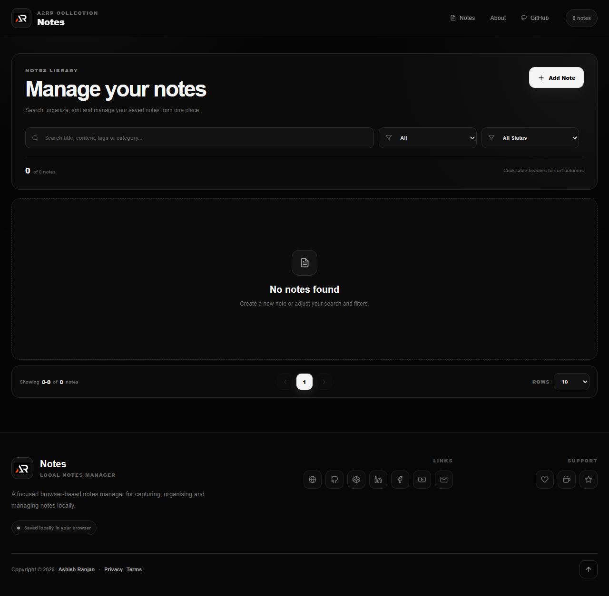

# Notes

Notes is a focused React and Vite app for creating, organising and managing browser-local notes.



## Features

- Create, edit, view, pin and delete notes
- Search by title, content, category or tags
- Filter by category and pinned state
- Sort by title, dates and pin state
- Paginate the notes table with selectable page sizes
- Persist data in LocalStorage
- Responsive fixed header, mobile menu, icon footer and go-to-top control

## Tech stack

React, Vite, styled-components, React Icons, React Toastify, SweetAlert2 and LocalStorage.

## Run locally

```bash
npm install
npm run dev
```

## Deploy

```bash
npm run deploy
```

Live site: [Notes](https://a2rp.github.io/notes/)

## Links

- Portfolio: [https://www.ashishranjan.net/](https://www.ashishranjan.net/)
- GitHub: [https://github.com/a2rp](https://github.com/a2rp)
- CodePen: [https://codepen.io/ash1198](https://codepen.io/ash1198)
- LinkedIn: [https://www.linkedin.com/in/aashishranjan](https://www.linkedin.com/in/aashishranjan)
- Facebook: [https://www.facebook.com/theash.ashish/](https://www.facebook.com/theash.ashish/)
- YouTube: [https://www.youtube.com/@ashishranjan-ashz?sub_confirmation=1](https://www.youtube.com/@ashishranjan-ashz?sub_confirmation=1)
- Email: [mailto:ash.ranjan09@gmail.com](mailto:ash.ranjan09@gmail.com)

## Support

- Support: [https://a2rp-donation-page.netlify.app/](https://a2rp-donation-page.netlify.app/)
- Buy Me a Coffee: [https://buymeacoffee.com/a2rp](https://buymeacoffee.com/a2rp)
- Patreon: [https://patreon.com/a2rp](https://patreon.com/a2rp)